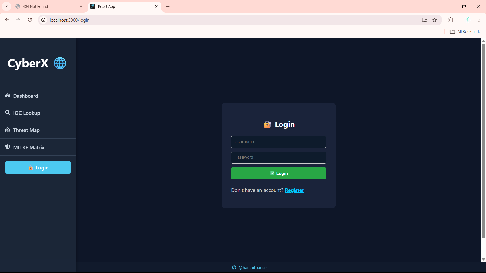
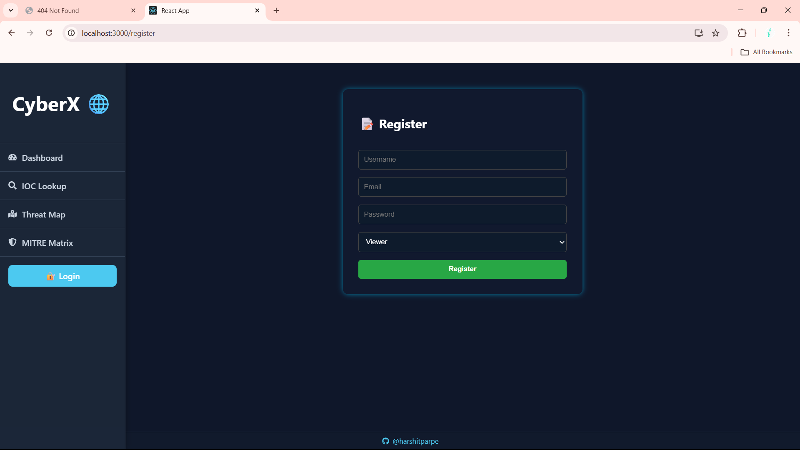
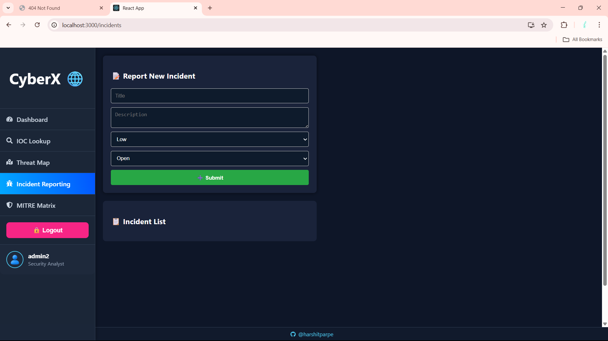
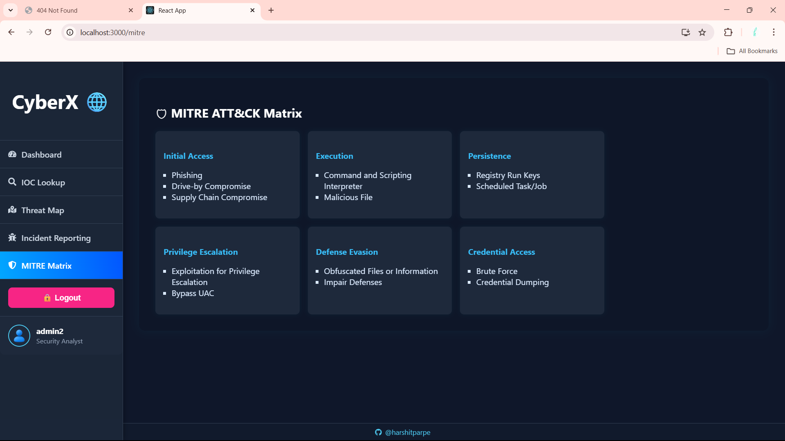

# 🛡️ Cyber Threat Intelligence (CTI) Dashboard

A full-stack dashboard for real-time IOC visualization and secure incident reporting.

## 🚀 Features

- 🌍 **IOC Threat Map**: Interactive world map colored by country-wise IOC lookup frequency.
- 📝 **Incident Reporting**: Secure analyst-only incident submission.
- 📋 **Incident List & Details**: View and inspect all reported incidents in a modal.
- 📊 **Incident Stats**: Get total incidents, severity breakdown, status breakdown, and last reported time.
- 🔐 **JWT Auth + Role Control**: Access restricted to authenticated users with the `analyst` role.

---

## 🛠️ Tech Stack

### 🔹 Frontend (React.js)

- React + Axios
- `react-simple-maps` + `d3-scale` for map visuals
- Components: `ThreatMap`, `IncidentForm`, `IncidentList`, `IncidentDetailModal`
- Role-based views and JWT management

### 🔹 Backend (Flask)

- Flask with Blueprints
- MongoDB using `pymongo`
- `flask-jwt-extended` for secure authentication
- Endpoints for incidents, map data, stats

---

## ⚙️ Setup Instructions

### 🔸 Backend (Flask)

```bash
pip install flask flask-cors flask-jwt-extended pymongo
python app.py
```

> Make sure MongoDB is running locally on port `27017`.

### 🔸 Frontend (React)

```bash
cd frontend
npm install
npm start
```

---

## 📸 Screenshots

- Login Page
  

- Registeration Page
  

- Dashboard
  

- IOC Lookup
  

- Incidents Reporting
  

- Threat Map
  

- MITRE
  

---

## 📊 API Endpoints

### 🔐 Auth

- `POST /api/auth/login`
- `POST /api/auth/register`

### 📍 Incidents

- `POST /api/incidents/` – Create new incident (analyst only)
- `GET /api/incidents/` – Fetch all incidents
- `GET /api/incidents/stats` – Get severity/status stats

### 🌐 Map

- `GET /api/map/ioc/country-counts` – Get IOC count by country

---

## 🧠 Notes

- JWT is stored in `localStorage` (`getToken()` in `/utils/auth.js`)
- Country code issues are resolved via ISO3→ISO2 conversion
- The frontend filters and displays map & incident data live
- Extendable: role-based editing, export to CSV, filters

---

## 👤 Author

- **Harshit Parpe**  
  Full-stack developer & cybersecurity enthusiast

---

## 📄 License

MIT License
