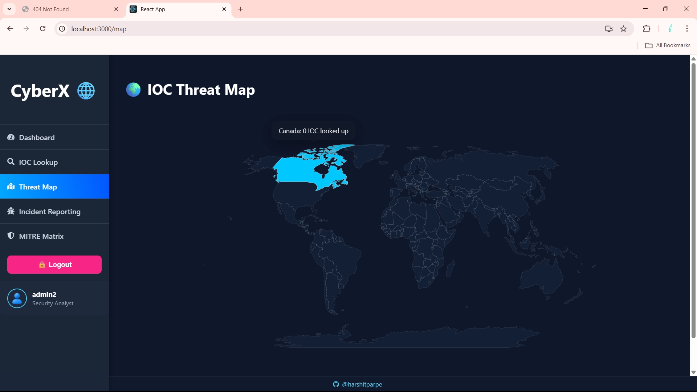

# 🛡️ CyberX - Cyber Threat Intelligence Dashboard

CyberX is a full-stack Cyber Threat Intelligence (CTI) dashboard designed to help analysts track, investigate, and visualize global cyber threats in real-time. Built with **React** and **Flask**, this tool integrates IOC lookups, threat maps, incident reporting, and MITRE ATT&CK mappings for efficient threat analysis and response.

---

## 🚀 Features

### ✅ IOC Lookup

- Lookup IPs, domains, hashes using mock (or real) threat intelligence APIs
- Displays **severity with color-coded badges**
- Supports **copy to clipboard** and **export to JSON**
- Maintains **local search history**

### 🌍 Threat Map

- Interactive world map using `react-simple-maps`
- Countries are color-coded by **threat volume**
- Hover tooltips show **country name + count**
- Ready for API integration and filtering feed by location

### 📋 Incident Reporting

- Create, view, and manage cybersecurity incidents
- Fields: title, description, severity, status
- Shows list of incidents with modal detail view
- Fully connected to MongoDB

### 🎯 MITRE ATT&CK Mapping

- View mock mappings of threats to tactics and techniques
- Filter threats by ATT&CK categories (coming soon)

### 🔐 JWT Authentication (Planned)

- User registration & login
- Role-based access (Analyst, Admin)
- Protect routes based on roles

---

## 📸 UI Screenshots

### Dashboard


### IOC Lookup


### Threat Map



### Incident Report


---

## 🧑‍💻 Tech Stack

| Frontend          | Backend            | Database    | Tools          |
| ----------------- | ------------------ | ----------- | -------------- |
| React             | Flask              | MongoDB     | Axios, JWT     |
| React Router DOM  | Flask-JWT-Extended | MongoClient | Vercel, Render |
| React Simple Maps | Flask-CORS         |             | dotenv         |

---

## 🛠️ Setup Instructions

### 1. Clone the Repository

```bash
git clone https://github.com/<your-username>/cyberx-dashboard.git
cd cyberx-dashboard
```
